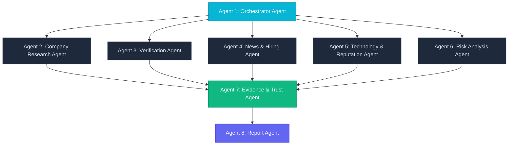

# Vishleshan AI — 8-Agent Modular Architecture

> [!IMPORTANT]
> **Architecture Principle**: Vishleshan AI rejects monolithic "general-purpose" AI agents. Research is decomposed into 8 specialized, narrow-boundary agents with standardized envelopes and deterministic evidence contracts.

---

## 1. Agent Swarm Overview



---

## 2. Specialized Agent Roles & Boundaries

### Agent 1: Orchestrator Agent (`orchestrator`)
* **Role**: Coordinates research run lifecycle, executes initial identity resolution, dispatches parallel agent branches, and persists final results to Supabase.
* **Failure Handling**: Tolerates partial agent failures. If one branch fails, the run completes with remaining evidence as `status="partial"`.

### Agent 2: Company Research Agent (`company_research`)
* **Role**: Extracts canonical company profile, overview, products/services, and primary web domains.
* **Sources**: Official company website (`OfficialWebsiteAdapter`), open encyclopedic APIs (`PublicSearchAdapter`).
* **Output**: Verified corporate profile claims and domain bindings.

### Agent 3: Verification Agent (`verification`)
* **Role**: Cross-verifies domain provenance, registration filings, and legal operational status.
* **Semantic States**: `verified`, `unverified`, `conflicting`, `unable_to_verify`.
* **Critical Rule**: Missing evidence is recorded as `unable_to_verify` and is **never** defaulted to fraud.

### Agent 4: News & Hiring Agent (`news_hiring`)
* **Role**: Gathers press releases, corporate announcements, official careers portals, and active recruitment channels.
* **Provenance**: Every item requires `source_url`, `source_title`, and `observed_at`.

### Agent 5: Technology & Reputation Agent (`technology_reputation`)
* **Role**: Evaluates digital web infrastructure (HTTPS/TLS), DNS, and public professional footprints.
* **Provenance**: Clearly labels weak sources; never treats opinions as verified facts.

### Agent 6: Risk Analysis Agent (`risk_analysis`)
* **Role**: Signal collection only (domain mismatch, corporate identity inconsistency, recruitment spoofing risk).
* **Output**: Structured `indicators`, `warnings`, and `supporting_evidence`. Does not make unsupported fraud accusations.

### Agent 7: Evidence & Trust Agent (`evidence_trust`)
* **Role**: Aggregates evidence across all parallel branches, computes deterministic SHA-256 content hashes, deduplicates identical findings, and evaluates source diversity.

### Agent 8: Report Agent (`report_agent`)
* **Role**: Assembles the complete 13-section Company Intelligence Report from verified evidence, ensuring all claims link to clickable citations.

---

## 3. Standardized Agent Envelope Contract

Every agent in Vishleshan AI returns a uniform JSON envelope:

```json
{
  "agent_name": "company_research",
  "agent_version": "1.0",
  "status": "completed",
  "research_run_id": "00000000-0000-0000-0000-000000000000",
  "findings": [],
  "evidence": [
    {
      "claim": "Google operates official domain google.com",
      "evidence_text": "Official homepage title and domain registration verified.",
      "source_url": "https://google.com",
      "source_title": "Google — Official Homepage",
      "source_type": "official_company",
      "published_at": null,
      "observed_at": "2026-08-12T05:00:00Z",
      "reliability_score": 0.90,
      "confidence_score": 0.95,
      "verification_status": "verified",
      "agent_name": "company_research",
      "content_hash": "f433c1c1937641d8c0953c2fa232cb58f22b7c08189cf636ebd847eddd767b45"
    }
  ],
  "warnings": [],
  "errors": [],
  "metadata": {},
  "executed_at": "2026-08-12T05:00:01Z"
}
```
