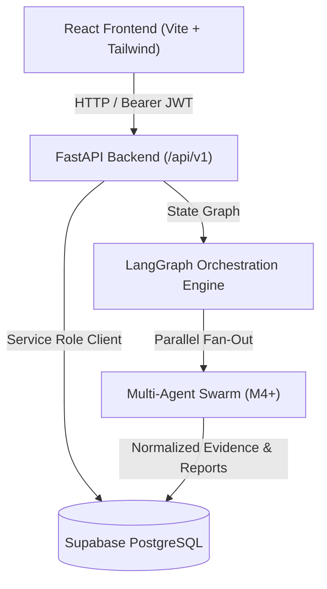

# Vishleshan AI — System Architecture

## 1. Architectural Overview

Vishleshan AI is an evidence-driven, explainable corporate intelligence and trust analysis platform. It uses a layered, decoupled architecture designed for verification provenance and multi-agent pipeline orchestration.



---

## 2. Backend Layering Principle

The backend strictly follows a layered Separation of Concerns:

```text
[HTTP Client / Frontend]
        │
        ▼ (FastAPI Routers: backend/app/api/)
  API Routes: Thin Controllers (validates schemas, dependencies)
        │
        ▼ (Business Logic: backend/app/services/)
  Services: Domain logic, ownership enforcement, payload assembly
        │
        ▼ (Data Access: backend/app/repositories/)
  Repositories: Database querying, filtering, table mapping
        │
        ▼ (Persistence Client: backend/app/integrations/supabase.py)
  Supabase Client: PostgreSQL connection and PostgREST API
```

---

## 3. Directory Layout

* `backend/app/api/`: Route handlers for health, companies, research, history, evidence, reports.
* `backend/app/core/`: Configuration, logging, exception definitions, and Supabase JWT authentication.
* `backend/app/integrations/`: Centralized Supabase integration layer.
* `backend/app/repositories/`: Database abstraction repositories.
* `backend/app/schemas/`: Pydantic input and output validation models.
* `backend/app/services/`: Reusable business logic services.
* `backend/tests/`: Comprehensive Pytest automated test suite.
