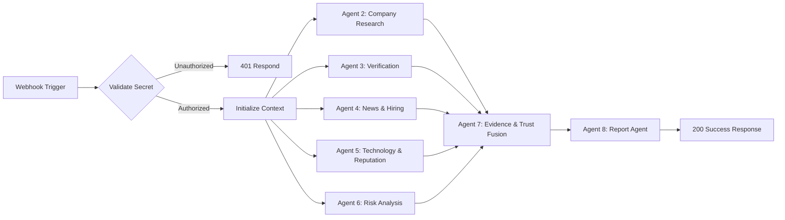

# Vishleshan AI — n8n Multi-Agent Workflow Guide

> [!NOTE]
> Vishleshan AI can orchestrate research runs either using the internal Python Multi-Agent Orchestrator (`RESEARCH_ORCHESTRATOR_MODE=local`) or by delegating to a self-hosted n8n workflow engine (`RESEARCH_ORCHESTRATOR_MODE=n8n`).

---

## 1. Workflow Architecture

The exportable workflow definition is located at:
[`n8n/workflows/research-orchestrator.json`](file:///c:/Users/arpan/Desktop/VISHLESHAN%20AI/n8n/workflows/research-orchestrator.json)



---

## 2. Configuration & Environment Variables

Configure the following variables in `backend/.env`:

```ini
# Orchestrator Mode ("local" or "n8n")
RESEARCH_ORCHESTRATOR_MODE=n8n
N8N_BASE_URL=http://localhost:5678
N8N_WEBHOOK_PATH=/webhook/vishleshan-research
N8N_WEBHOOK_SECRET=dev-vishleshan-secret-2026
N8N_TIMEOUT_SECONDS=30.0
```

---

## 3. Webhook Security

Every request dispatched from FastAPI to n8n carries the secret authentication header:
```http
X-Vishleshan-Webhook-Secret: dev-vishleshan-secret-2026
X-Correlation-ID: <research_run_id>
```

The n8n workflow evaluates `$headers['x-vishleshan-webhook-secret']` against `$env.N8N_WEBHOOK_SECRET` and rejects unauthorized callers with HTTP 401.

---

## 4. How to Import and Activate in n8n

1. Start your local n8n instance:
   ```bash
   npx n8n
   ```
2. Open your browser to `http://localhost:5678`.
3. In the left navigation menu, click **Workflows** $\to$ **Import from File...**.
4. Select `n8n/workflows/research-orchestrator.json`.
5. Ensure the top-right toggle is switched to **Active**.
6. Set the `N8N_WEBHOOK_SECRET` environment variable in your n8n runtime environment matching `backend/.env`.

---

## 5. Local Networking Note

* **Native Node / npm**: If n8n and FastAPI run natively on Windows host, `http://localhost:5678` and `http://localhost:8000` communicate directly.
* **Docker Container**: If n8n runs inside Docker on Windows, use `http://host.docker.internal:8000` to reach the FastAPI host backend from inside the container.
