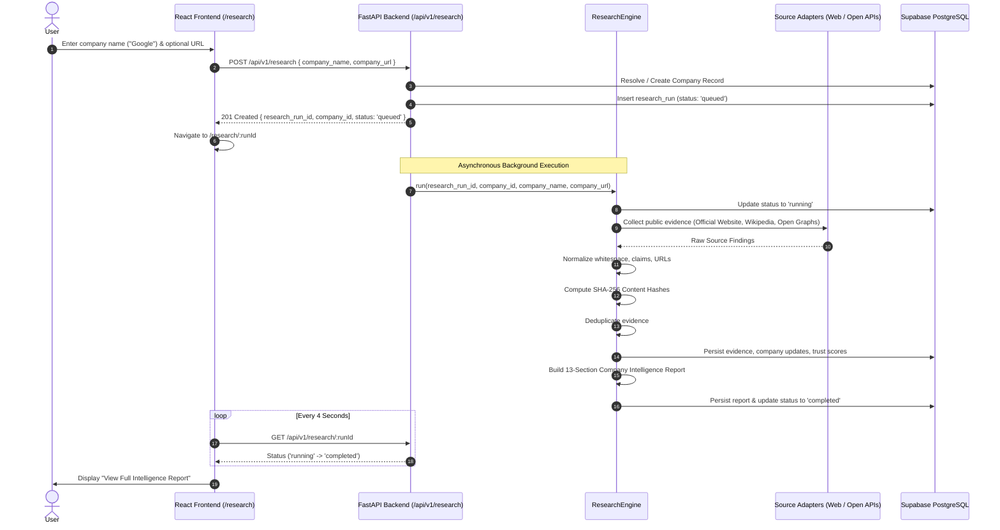

# Vishleshan AI — Research Engine (M4 Vertical Slice)

> [!IMPORTANT]
> **Milestone Notice**: M4 is an initial single-pipeline evidence research engine and not the final multi-agent swarm architecture. Full 8-agent distributed orchestration will be introduced in Milestone M5+.

---

## 1. Research Lifecycle

The M4 research lifecycle connects the React frontend directly to Supabase through the FastAPI backend:

---

## 2. Source Adapter Architecture

Source collection is decoupled using the `BaseSourceAdapter` abstract base class located in `backend/app/research/sources/`:

* **`OfficialWebsiteAdapter`** (`official_website.py`):
  * Respects standard polite headers and timeouts (8.0s).
  * Crawls the primary domain (`https://{domain}`).
  * Extracts page title, meta description, and primary headers (`<h1>`).
  * Automatically discovers `/about` and `/careers` sub-pages.
  * Assigns `SourceType.OFFICIAL_COMPANY` and `SourceType.OFFICIAL_CAREERS`.
* **`PublicSearchAdapter`** (`search.py`):
  * Queries open knowledge APIs (e.g. Wikipedia summary endpoint) and open search engines.
  * Extracts corporate summaries, operational context, and official domains without scraping paywalled or restricted content.
  * Assigns `SourceType.NEWS` or `SourceType.OTHER`.

---

## 3. Evidence Normalization & Hashing

Every collected finding is normalized via `EvidenceNormalizer` (`backend/app/research/normalizer.py`):

1. **Text Normalization**: Strips excess whitespace and normalizes URLs.
2. **Cryptographic Hashing**: Computes a stable SHA-256 content hash:
   $$\text{hash} = \text{SHA256}(\text{normalized\_claim} \parallel \text{source\_url} \parallel \text{normalized\_evidence\_text})$$
3. **Deduplication**: `EvidenceDeduplicator` filters duplicate findings sharing the same content hash across repeated queries while preserving distinct multi-source observations.

---

## 4. Deterministic Source Reliability Defaults

Preliminary M4 configuration defaults (not empirically validated or LLM-hallucinated):

| Source Type | Default Reliability Score | Initial Verification Status |
| :--- | :--- | :--- |
| **Government / Regulator** (`government`, `regulator`) | `0.98` | `verified` |
| **Certification Body** (`certification_body`) | `0.95` | `verified` |
| **Official Corporate Website** (`official_company`) | `0.90` | `verified` |
| **Official Careers Portal** (`official_careers`) | `0.90` | `verified` |
| **Official Announcements** (`official_announcement`) | `0.88` | `verified` |
| **Reputable News** (`news`) | `0.80` | `unverified` |
| **Professional Network** (`professional_network`) | `0.65` | `unverified` |
| **Employee Reviews / Forums / Blogs** (`employee_review`, `forum`, `blog`) | `0.50` | `unverified` |
| **General Web Sources** (`other`) | `0.50` | `unverified` |

---

## 5. Report Generation

The deterministic `ReportBuilder` (`backend/app/research/report_builder.py`) builds the complete 13-section Company Intelligence Report:
* **Company Overview**: Canonical identity, description, and primary domain.
* **Official Resources**: Direct verified homepage and careers links.
* **Identity Verification**: Corroborated evidence counts and domain verification status.
* **Trust & Risk Evaluation**: Deterministic reliability score weighting and risk indicators.
* **Evidence & References**: Full list of clickable source URLs with observation timestamps and cryptographic hashes.
